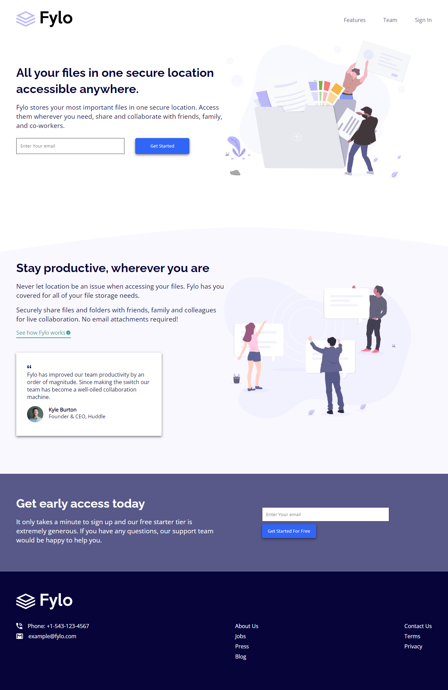

# landing-page-with-two-column-layout
A responsive -fylo- landing page using HTML and CSS

This is a solution to the [Fylo landing page with two column layout challenge on Frontend Mentor](https://www.frontendmentor.io/challenges/fylo-landing-page-with-two-column-layout-5ca5ef041e82137ec91a50f5). Frontend Mentor challenges help you improve your coding skills by building realistic projects. 

## Table of contents

- [Overview](#overview)
  - [The challenge](#the-challenge)
  - [Screenshot](#screenshot)
  - [Links](#links)
- [My process](#my-process)
  - [Built with](#built-with)
  - [What I learned](#what-i-learned)
  - [Useful resources](#useful-resources)
- [Author](#author)
- [Acknowledgments](#acknowledgments)

## Overview

### The challenge

Users should be able to:

- View the optimal layout for the site depending on their device's screen size
- See hover states for all interactive elements on the page
### Screenshot

### Links

- Solution URL: [Solution Site](https://www.frontendmentor.io/solutions/landing-page-with-two-column-layout-GGDq_ulmC)
- Live Site URL: [Live Site](https://islemmedjahdi.github.io/landing-page-with-two-column-layout/)

## My process

### Built with

- Semantic HTML5 markup
- CSS Flexbox

### What I learned

- Styling Input Fields
- 
### Useful resources

- [Developer Mozzila](https://developer.mozilla.org) 

## Author

- Frontend Mentor - [@IslemMedjahdi](https://www.frontendmentor.io/profile/IslemMedjahdi)
- Twitter - [@IslemMedjahdi](https://twitter.com/IslemMedjahdi)

## Acknowledgments
